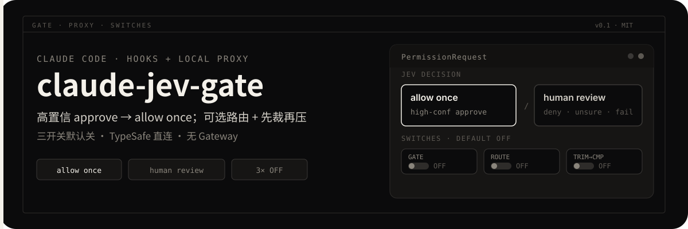
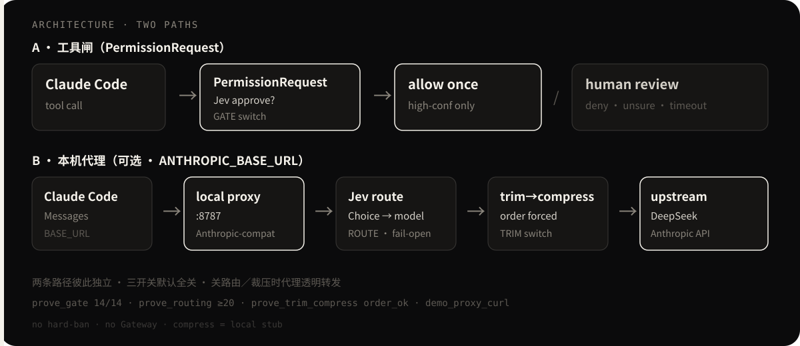

# claude-jev-gate

<p align="center">
  
</p>

给 [Claude Code](https://docs.anthropic.com/en/docs/claude-code) 加两件可选能力：

1. **工具闸**（`PermissionRequest` hook）：高置信 TypeSafe **Jev** `approve` → 代点**允许这一次**；`deny`／`unsure`／低置信／超时／异常 → 交回人审。不做 session／always。
2. **本机 Anthropic 兼容代理**：可选 **模型路由**（Jev Choice → 改写 model；失败 fail-open **客户端请求的 model**）+ **先裁再压**（强制 trim → compress）。

三开关默认**全关**，彼此独立。TypeSafe **直连**（`TYPESAFE_API_KEY`）；**禁止** Vercel AI Gateway。密钥不进仓、不打印。

<p align="center">
  
</p>

## 最短上手

### 1. 先验（无需 Key）

```bash
cd /path/to/claude-jev-gate
python3 scripts/prove_gate.py            # 工具闸（含 mock 双开关防护）
python3 scripts/prove_routing.py         # ≥20 样本选型分布＋兜底＋长 system 不误判
python3 scripts/prove_trim_compress.py   # 先 trim 再 compress（order_ok；短会话不猛砍）
python3 scripts/prove_proxy.py           # 代理 HTTP 层：透明／凭据／鉴权／Key 选择／fail-open／tool 配对
./scripts/demo_proxy_curl.sh             # 自启 mock 代理 + curl Messages
```

四个 prove 必须 exit 0，都不需要 Key 或 `typesafe_sdk`。routing／trim_compress 报告落在临时目录（不改写公开树）。

### 2. 起代理（可选）

```bash
cd /path/to/claude-jev-gate
export CLAUDE_JEV_UPSTREAM_MOCK=1   # 无上游 Key 时；不设又没配上游 URL → 代理回 503，不会假装成功
# 可选打开路由／裁压：
# export CLAUDE_JEV_ROUTE_ENABLED=true
# export CLAUDE_JEV_TRIM_COMPRESS_ENABLED=true
# export CLAUDE_JEV_ROUTE_MOCK=heuristic

# 优先用 typesafe-venv；也可用环境变量覆盖（见下）
export CLAUDE_JEV_GATE_PYTHON="${CLAUDE_JEV_GATE_PYTHON:-python3}"
"$CLAUDE_JEV_GATE_PYTHON" bin/proxy_server.py
# 默认 http://127.0.0.1:8787
```

Claude Code 指到代理：

```bash
export ANTHROPIC_BASE_URL=http://127.0.0.1:8787
# 真打上游时：CLAUDE_JEV_UPSTREAM_MOCK=0
# + CLAUDE_JEV_UPSTREAM_BASE_URL（例：https://api.deepseek.com/anthropic）
# + CLAUDE_JEV_UPSTREAM_API_KEY（推荐显式）或按 host 自动选 DEEPSEEK_API_KEY／ANTHROPIC_API_KEY
```

代理的安全边界：

- **可选客户端鉴权**（`CLAUDE_JEV_PROXY_AUTH_TOKEN`，默认关）。开启后请求须带 `x-claude-jev-proxy-token`；无／错 → 401。共享机建议开启。
- 默认只听 `127.0.0.1`；绑非回环地址会打印警告（有 token 时警告文案会注明已开鉴权）。
- 只接受回环 `Host` 且 `Content-Type: application/json` 的请求（挡网页跨站 simple request 与 DNS rebinding 盗刷额度）。
- **Key 按上游选**：`CLAUDE_JEV_UPSTREAM_API_KEY` 优先；否则 deepseek host → 仅 `DEEPSEEK_API_KEY`；anthropic host → 仅 `ANTHROPIC_API_KEY`；未知 host 不自动猜。代理自带 Key 时**不透传**客户端 `x-api-key`／`Authorization`。
- 不跟随上游重定向（3xx 原样回给客户端）。
- 请求体默认上限 32MiB（`CLAUDE_JEV_PROXY_MAX_BODY_BYTES`）；超限 413。
- `/v1/messages/count_tokens`：有上游则透传，否则 501。
- SSE：客户端 `stream=true` 时尽量 chunked 流式回写；非 stream／mock 仍整包缓冲。透传 `request-id`／`retry-after`／限流相关头。

### 3. 装工具闸 plugin

把本仓加为本地 Claude Code plugin（或 symlink），确保 `hooks/hooks.json` 被加载。需要时再开闸：

```bash
export CLAUDE_JEV_GATE_ENABLED=true
# Live Jev：export TYPESAFE_API_KEY=...   # 勿写入 git
# 离线演练须双开（防生产误开全放行）：
# export CLAUDE_JEV_GATE_MOCK=approve
# export CLAUDE_JEV_GATE_ALLOW_MOCK=1
```

仅设 `CLAUDE_JEV_GATE_MOCK=approve`、**没有** `CLAUDE_JEV_GATE_ALLOW_MOCK=1` 时，mock **不会**生效（走缺 Key → unsure／交回人审）。events 会标记 `mock`／`allow_mock`／`mock_requested`。

可选：把 `hooks/hooks.json` 里的 command 拷到项目 `.claude/settings.json`，把 `${CLAUDE_PLUGIN_ROOT}` 换成绝对路径。

## 三开关

| 变量 | 默认 | 含义 |
|------|------|------|
| `CLAUDE_JEV_GATE_ENABLED` | 关 | PermissionRequest 工具闸 |
| `CLAUDE_JEV_ROUTE_ENABLED` | 关 | 代理内模型路由 |
| `CLAUDE_JEV_TRIM_COMPRESS_ENABLED` | 关 | 代理内先裁再压 |

全关：可不启代理（直连上游＋原版人审）；若启代理且路由／裁压都关，则**透明转发**（不改 model、不改 messages；透传 `anthropic-version`／`anthropic-beta` 与 query）。

其它常用变量见 `config.example.env`。

## 解释器与 TypeSafe 路径

Hook 走 `bin/permission_request.sh`，解释器按序取：

```text
CLAUDE_JEV_GATE_PYTHON
→ $CLAUDE_JEV_GATE_TYPESAFE_VENV/bin/python
→ /workspace/tools/typesafe-venv/bin/python（原开发机，存在才用）
→ python3
```

| 变量 | 作用 |
|------|------|
| `CLAUDE_JEV_GATE_PYTHON` | hooks／代理用的 Python 解释器 |
| `CLAUDE_JEV_GATE_TYPESAFE_VENV` | typesafe-venv 根目录 |
| `CLAUDE_JEV_GATE_TYPESAFE_SITE_PACKAGES` | 直接指定 site-packages（可用 `:` 分隔） |

`ensure_typesafe_path` 对 site-packages **insert(0)**，避免系统旧 `typing_extensions` 抢先。需要 Python 3.10+。Live Jev 需可导入 `typesafe_sdk`。

## 输出契约（工具闸，Claude Code 2.1.278）

代 allow 一次：

```json
{"hookSpecificOutput":{"hookEventName":"PermissionRequest","decision":{"behavior":"allow"}}}
```

交回人审：exit 0 + 空 stdout。不写 always／session／`updatedPermissions`／`applyRules`。

脱敏后的工具输入超过 4000 字符（Jev 看不全）时不询问 Jev，直接交回人审。

## 路由与裁压要点

- **路由 fail-open**：超时／异常／低置信时用**客户端请求的 model**；客户端未给再用 `CLAUDE_JEV_PRIMARY_MODEL`。禁止无条件把 `deepseek-chat` 塞给 Anthropic 上游。
- **无 `TYPESAFE_API_KEY`**：走启发式，`reason=missing_typesafe_key`（或 mock／dry_run）。超时后后台 daemon 线程仍可能跑完一次 Jev，但不 wait、不堵请求。
- **启发式**：默认只用 **user 消息**判 bucket，避免 Claude Code 长 system 几乎总判 `tool_heavy`。
- **裁压**：强制 trim → compress。compress 为本地启发式 stub；仅当非 system 消息数 ≥ `CLAUDE_JEV_COMPRESS_MIN_MESSAGES`（默认 8）**且**总 chars ≥ `CLAUDE_JEV_COMPRESS_MIN_CHARS`（默认 8000）才压缩。
- **计轮**：trim 以每条 `role=user` 开启一轮（含仅含 `tool_result` 的 user）；与 Anthropic「一对 user+assistant」语义不同，偏保守。
- **cache_control**：开裁压时尽量保留原 `system` 数组上的 `cache_control`；文本被改写时尽量挂回第一个 text block。

## 已知限制

- compress 为**本地启发式 stub**（可证明顺序），不是上游 LLM 压缩；顺序强制 trim → compress。被裁断的 `tool_use`／`tool_result` 会成对剔除。
- 工具闸不做硬禁第二开关；默认关；无 session／always 缓存。
- Live 依赖 TypeSafe 额度与 `TYPESAFE_API_KEY`；脱敏尽力而为，非安全边界。
- **提示注入**：LLM 判官天然存在提示注入风险；输入侧会 scrub 常见注入句式并在 events 标 `injection_suspect`；**0.80 置信门槛只部分缓解，不承诺消灭**。
- 路由 fail-open 到客户端 model／主模型；不引入 Gateway。
- 非 SSE／mock 路径仍可能整包缓冲上游响应。
- 不计费、不代持买家 Key；本仓未针对 macOS 装机／上架做专门流程。

## 目录

```text
.claude-plugin/plugin.json
hooks/hooks.json
bin/permission_request.sh   # hook 启动器：选解释器后 exec permission_request.py
bin/permission_request.py
bin/proxy_server.py
claude_jev_gate/
  config.py decide.py jev_client.py redact.py events.py timeouts.py   # 工具闸
  routing.py trim.py compress.py pipeline.py                          # 路由／裁压
  proxy/   # Anthropic Messages 兼容小服务
data/routing_samples.jsonl
scripts/prove_gate.py
scripts/prove_routing.py
scripts/prove_trim_compress.py
scripts/prove_proxy.py
scripts/demo_proxy_curl.sh
.github/workflows/prove.yml
config.example.env
docs/readme-assets/
```

## License

MIT — 见 [`LICENSE`](./LICENSE)。
